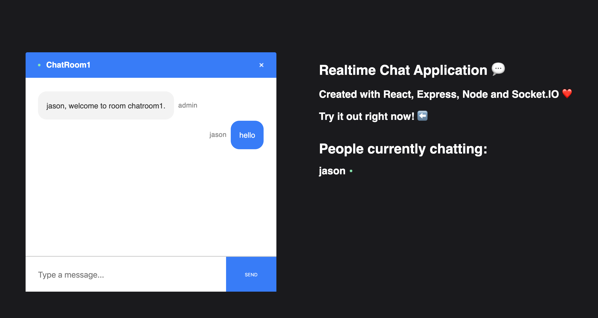
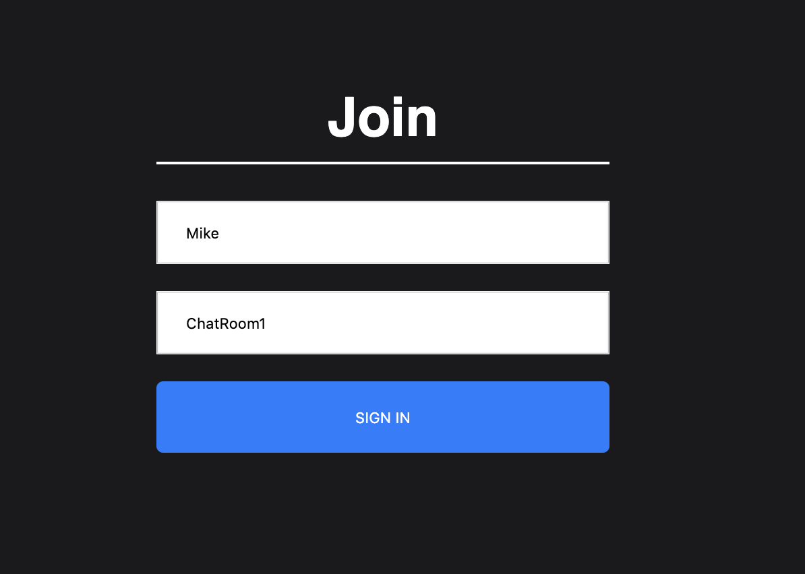
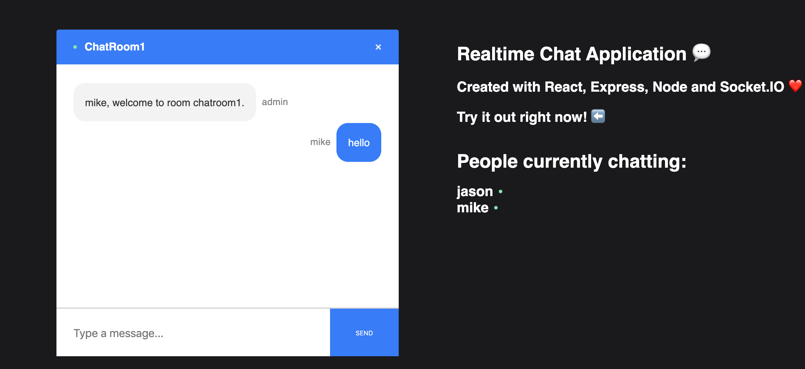
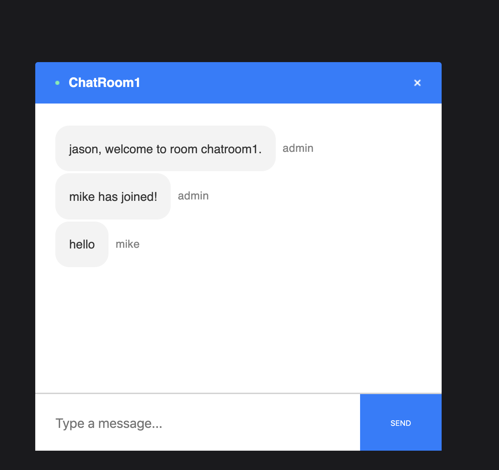

# chat-app

Demo: https://dazzling-morse-2b493c.netlify.com

Type in name and chat room id

can use the application to send to friends as long as the chat room id is the same

application is fully real time

Realtime Chat Application. React on the front end, with NodeJS + Socket.io web socket library on the back end
